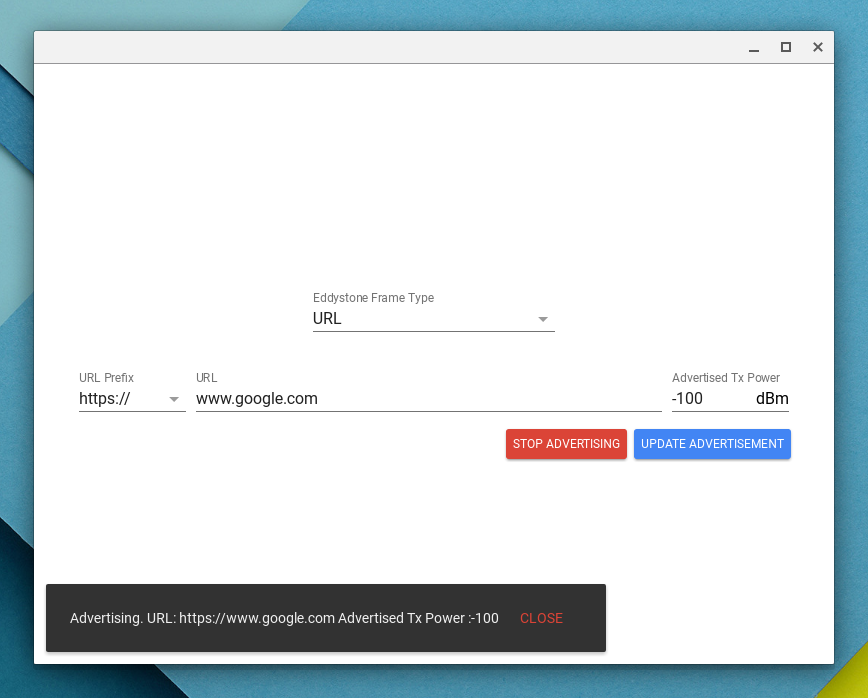
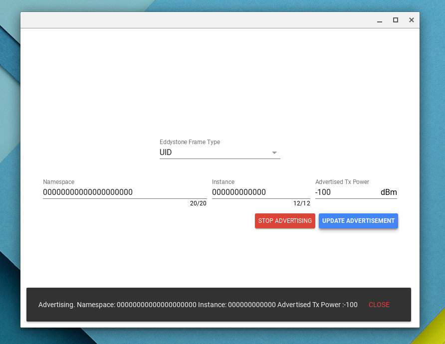

# eddystone-chrome-apps-sample
Chrome App to advertise Eddystone packets.
Uses the Eddystone Advertising library available [here](https://github.com/google/eddystone/tree/master/libraries/javascript/eddystone-advertising).

# BLE Advertising Availability
BLE Advertising is only available in Single App Kiosk Mode.

For *development* you should turn on the `enable-ble-advertising-in-apps`
flag in `chrome://flags/#enable-ble-advertising-in-apps`. This will let
the app Advertise without being in Kiosk Mode. This only works in Chrome OS.

For *deployment* you should add the following to manifest.json:
```js
"kiosk_enabled": true,
"kiosk_only": true
```


